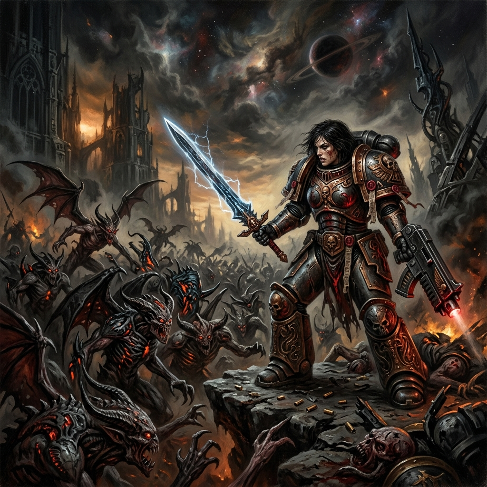

# Doomsky 🎮



A fast-paced, browser-based 3D retro shooter game built entirely from scratch using **Three.js**. Inspired by classic shooters like DOOM, Doomsky brings pixelated textures, fast movement, and intense demon-slaying action straight to your web browser.

👉 **[Play Doomsky Now!](https://Rinpocheshka.github.io/Doomsky/)** 

## Features 🚀
- **Fully 3D Engine:** Powered by Three.js with custom lighting, fog, and collision mechanics.
- **4 Unique Levels:** Battle through "The Bunker", "The Facility", "Hell Gate", and the final showdown in the "Boss Lair".
- **4 Weapon Types:** Pistol, Shotgun, Assault Rifle, and Plasma Gun.
- **Dynamic Enemies:** 3 unique enemy archetypes (Grunts, Runners, Tanks) + 1 terrifying Boss.
- **Pixel-Art Aesthetics:** Hand-crafted retro sprites, UI, and low-poly environments.

## Controls ⌨️
- **W, A, S, D** or **Arrows** — Move
- **Mouse** — Look around
- **Left Click** — Shoot
- **Space** — Jump (Double tap for Double Jump)
- **Shift** — Sprint
- **1, 2, 3, 4** — Switch Weapons
- **ESC** — Pause / Menu

## Running Locally 💻
To run the game locally, you need a local web server (to avoid CORS issues with loading textures).
1. Clone this repository: `git clone https://github.com/Rinpocheshka/Doomsky.git`
2. Open the folder: `cd Doomsky`
3. Run a local server. If you have Node.js installed, you can use `npx serve`:
   ```bash
   npx serve
   ```
4. Open `http://localhost:3000` in your browser.

## Technologies Used 🛠️
- [Three.js](https://threejs.org/) (WebGL rendering)
- Vanilla JavaScript, HTML5, CSS3

---
*Created by Messsir and Rinpocheshka.*
